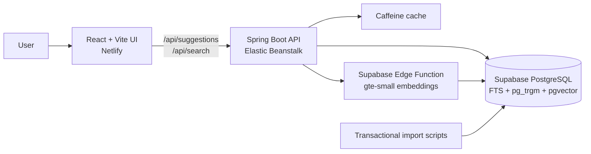

# Vehicle Auction Search

A full-stack vehicle-auction search application that combines exact, fuzzy, and semantic retrieval across a curated subset of historical auction listings.

## Architecture



The browser calls a single Spring Boot API. The service validates requests, applies the search fallback rules, caches results, and delegates ranking to indexed PostgreSQL functions. Supabase provides PostgreSQL, trigram search, vector search, and the embedding function. Netlify serves the compiled frontend and proxies `/api/*` to the backend.

### Search flow

1. **Suggestions:** a 250 ms debounced request returns up to eight prefix-first or typo-tolerant suggestions.
2. **Exact search:** weighted PostgreSQL full-text search prioritizes make and model matches.
3. **Fuzzy fallback:** trigram similarity recovers misspellings and preserves a recognized make as a strong constraint.
4. **Semantic fallback:** when exact results are absent and fuzzy coverage is thin, a 384-dimension query embedding is compared with vehicle-profile embeddings.
5. **Graceful degradation:** if embedding generation fails, the request still returns fuzzy results.

## Key capabilities

- Exact, fuzzy, and semantic vehicle search with explicit match labels
- Debounced, cancellable autocomplete with browser and server caching
- Stable pagination with a page size of up to 100 and a bounded ranking window
- Indexed PostgreSQL search using full-text search, `pg_trgm`, and `pgvector`
- Transactional CSV import with schema validation and dataset-version invalidation
- Responsive React interface with result tables and search-performance feedback
- Production deployment configuration for Netlify and AWS Elastic Beanstalk

## Technology stack

| Layer | Technology |
|---|---|
| Frontend | React 19, Vite 8, Material UI, Vitest |
| Backend | Java, Spring Boot, Spring JDBC, Caffeine |
| Data | Supabase PostgreSQL, `pg_trgm`, `pgvector` |
| Embeddings | Supabase Edge Function with `gte-small` |
| Hosting | Netlify frontend, AWS Elastic Beanstalk backend |

## Repository layout

```text
backend/                 Spring Boot API, service, repository, and cache layers
frontend/                React application and UI tests
supabase/migrations/     Ordered schema and search-function migrations
supabase/functions/      Query/profile embedding edge function
scripts/                 Import, migration, verification, and deployment scripts
ai/docs/                 Design, delivery record, and AI prompt history
netlify.toml             Frontend build, publish, and API proxy configuration
```

## API

### Suggestions

```http
GET /api/suggestions?q=toy
```

Returns up to eight prefix or fuzzy suggestions with the current dataset version.

### Search

```http
GET /api/search?q=BMW%20M3&page=0&size=100
```

Returns ranked listings, match type, pagination state, dataset version, and database elapsed time.

## Run locally

### Prerequisites

- Java 21+
- Maven 3.9+
- Node.js 20+
- A Supabase PostgreSQL project with the required extensions

Copy the environment template and provide your own credentials:

```bash
cp .env.example .env
```

Apply the database migrations and import the dataset:

```bash
scripts/apply-migrations.sh
scripts/import-data.sh /absolute/path/to/car_prices.csv
scripts/check-schema.sh
```

Start the backend:

```bash
scripts/run-backend.sh
```

Start the frontend in another terminal:

```bash
scripts/run-frontend.sh
```

## Verification commands

```bash
cd backend && mvn test
cd frontend && npm test
cd frontend && npm run build
```

Focused SQL checks are available in `scripts/*-search.test.sql`, `scripts/suggestions.test.sql`, and `scripts/vehicle-profiles.test.sql`.

## Deployment

The frontend deployment is defined in `netlify.toml`: Netlify builds from `frontend`, publishes `frontend/dist`, and proxies `/api/*` to the Elastic Beanstalk service. The backend deployment helper is `scripts/deploy-eb.sh`.

Deployment credentials belong in the ignored local `.env` file or the hosting platform's environment settings. They must never be committed.

## Engineering decisions

- PostgreSQL search was selected over a separate search cluster to keep the MVP operationally small.
- Vehicle-profile embeddings avoid generating vectors for every auction listing.
- Semantic search is conditional so direct matches stay fast and explainable.
- Caffeine is sufficient for the single-instance backend and uses the dataset version in cache keys.
- The working dataset is capped at 100,000 recent listings to bound shared-database storage and maintenance cost.
- Suggestion terms retain every make while filtering rare model, trim, and combination values.

## AI-assisted delivery record

The project was developed through an AI-assisted, reviewable workflow. Prompts, summarized responses, the approved technical design, implementation work items, decisions, and verification evidence are maintained under [`ai/docs/`](ai/docs/README.md).

These records are intentionally curated rather than copied verbatim: sensitive values, local machine details, and internal tool chatter are excluded.
