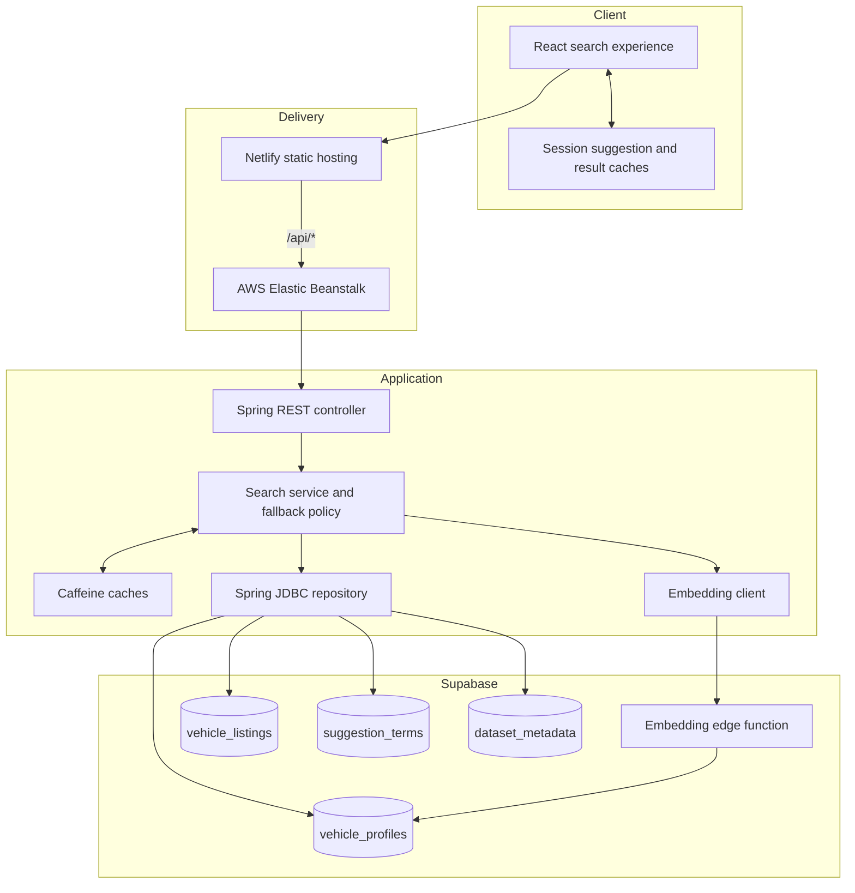
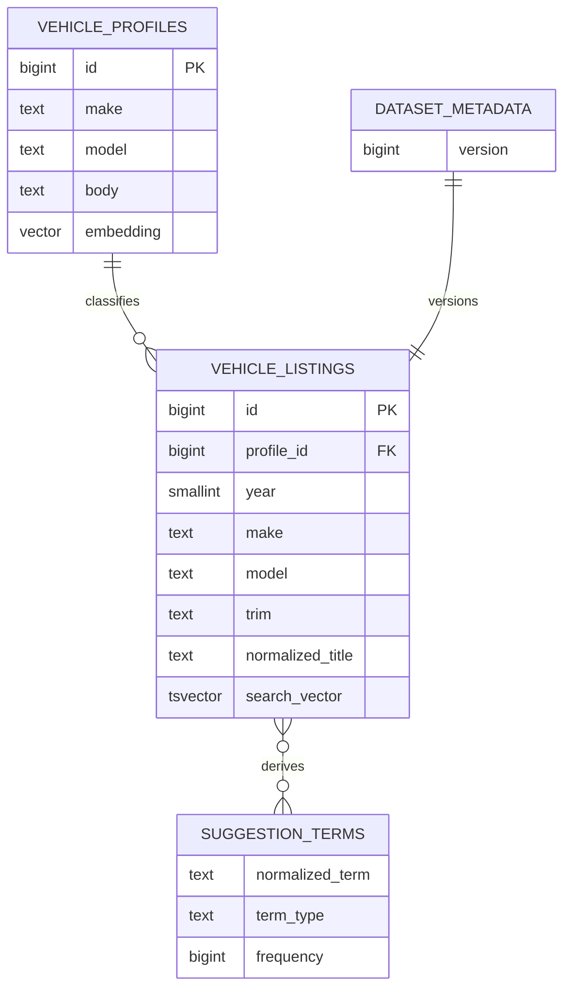
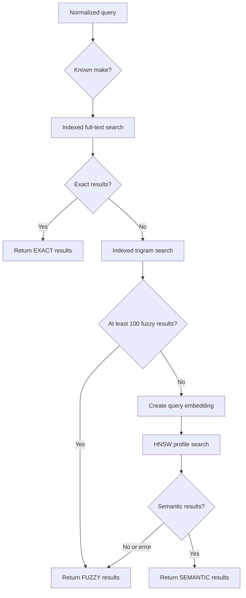
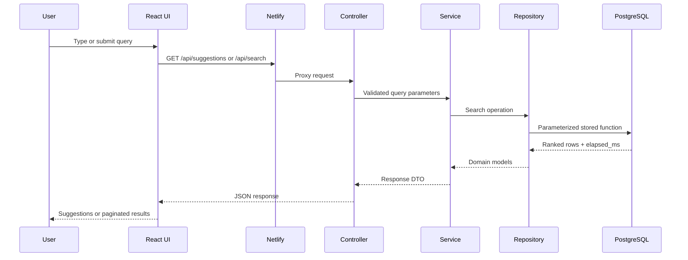
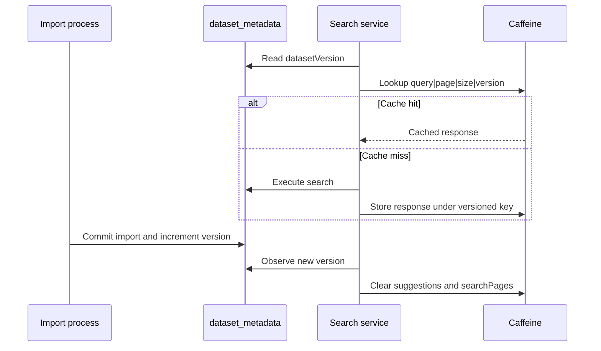
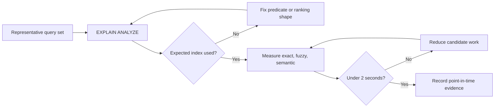
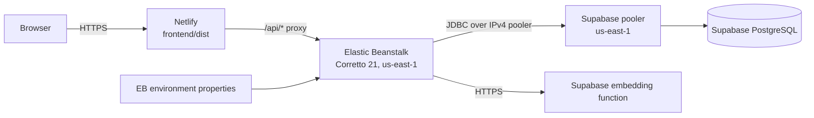

# Vehicle Auction Search MVP — Technical Design

## 1. Purpose and constraints

Build a credible vehicle-auction search experience within a six-hour MVP delivery window. A user can enter a vehicle query, receive debounced suggestions, and browse ranked, paginated results. Exact matches are preferred; fuzzy and semantic retrieval provide controlled fallbacks.

The source dataset contains historical auction records with make, model, trim, body, condition, mileage, market value, selling price, seller, state, and sale date. The operational working set is capped at the most recent 100,000 valid listings to keep database and index maintenance bounded.

### Success criteria

- Suggestions recover common misspellings and return no more than eight values.
- Exact matches rank ahead of fuzzy and semantic alternatives.
- A recognized make remains relevant when the requested model is unavailable.
- Results are stable across paginated requests.
- Typical searches are designed to complete within two seconds.
- Re-importing data invalidates stale server-side cache entries.
- Semantic-service failure does not make the complete search request fail.

## 2. Assumptions

The design depends on the following explicit assumptions. If any assumption changes, the architecture and operational tradeoffs must be reviewed.

- The source data changes through controlled batch imports rather than continuous synchronization.
- One Elastic Beanstalk backend instance is sufficient for the assignment workload; local Caffeine caches do not need distributed coordination.
- Supabase provides PostgreSQL full-text search, `pg_trgm`, pgvector, and an embedding edge function.
- A curated 100,000-row working set is sufficient to demonstrate large-dataset search behavior.
- Users primarily search by vehicle identity or description rather than advanced numeric filters.
- Ranking the top 500 candidates is sufficient for the expected review and demo workflow.
- The semantic model returns 384-dimension vectors compatible with stored profile embeddings.
- Authentication, per-user data, and multi-tenant isolation are not required for the assignment.
- Recorded performance measurements are environment-specific evidence, not a production service-level agreement.

## 3. System architecture

### Component responsibilities

- **React UI:** search input, 250 ms debounce, request cancellation, session caches, results, pagination, loading/error states, and performance feedback.
- **Netlify:** builds and serves the production frontend and forwards `/api/*` requests to the backend.
- **Spring Boot controller:** maps HTTP requests, validates parameters, and returns DTOs.
- **Spring Boot service:** owns exact/fuzzy/semantic fallback rules and cache policy without servlet dependencies.
- **Spring JDBC repository:** invokes parameterized PostgreSQL functions; JPA is unnecessary for this function-oriented database contract.
- **Caffeine:** caches suggestions for 30 minutes and search pages for 5 minutes with bounded entry counts.
- **Supabase PostgreSQL:** stores listings and derived search structures and performs full-text, trigram, and vector ranking.
- **Embedding edge function:** produces 384-dimension `gte-small` vectors for queries and vehicle profiles.
- **Import scripts:** validate the CSV, stage and normalize data transactionally, rebuild derived tables, increment the dataset version, and maintain indexes.

## 4. Data model

### `vehicle_listings`

Stores the curated auction records. Important fields include year, make, model, trim, body, transmission, state, condition, odometer, market value, selling price, sale date, and profile identifier.

Two generated search representations support retrieval:

- `search_vector`: weighted make/model/trim/body full-text content, with make and model receiving the strongest weight.
- `normalized_title`: normalized year/make/model/trim/body text used for trigram similarity.

Indexes cover full-text search, trigram matching, make, model, and profile joins.

### `vehicle_profiles`

Stores one row per normalized make/model/body combination, including profile text and one vector embedding. Listings share profiles, reducing vector generation and storage compared with embedding every auction row. An HNSW cosine index supports nearest-neighbor search.

### `suggestion_terms`

Stores normalized makes, models, trims, and make/model combinations with occurrence counts. Prefix and trigram indexes support fast autocomplete and typo recovery. All makes are retained; other term types require at least five occurrences.

### `dataset_metadata`

Stores a monotonically increasing dataset version. Successful imports advance the version; failed imports do not. The backend includes this value in cache keys so stale results are not reused.

## 5. Search and ranking

The API uses an ordered, conditional strategy:

1. **Exact/full-text stage:** rank matching listings with weighted PostgreSQL full-text search and explicit make, model, and year boosts. If a known make appears, exact candidates are restricted to that make.
2. **Fuzzy stage:** when exact search is empty, use indexed word/trigram similarity against normalized listing text. Make aliases such as `chevy` and `vw` are normalized before ranking.
3. **Semantic stage:** when exact search is empty and fuzzy results are fewer than 100, embed the query, identify related vehicle profiles, and join those profiles back to listings.
4. **Degradation path:** if query embedding or semantic retrieval fails, return the available fuzzy result set.

Results are ordered by match type, score descending, sale date descending, and stable identifier. Ranking work is bounded to the top 500 results. The default and maximum page size is 100.

## 6. API contract

### `GET /api/suggestions?q=`

- Requires a nonblank query.
- Returns no more than eight suggestions.
- Includes the observed dataset version.

### `GET /api/search?q=&page=&size=`

- Requires a nonblank query.
- Defaults to page `0` and size `100`.
- Caps size at `100`.
- Returns items, `hasNext`, search mode, dataset version, and elapsed database time.

## 7. Caching and invalidation

- The browser stores suggestions and search pages in session-lifetime `Map` caches held by `useRef`.
- Spring caches suggestions for 30 minutes and search pages for 5 minutes.
- Server cache keys include normalized query, page, size, and dataset version.
- A successful data refresh advances the dataset version and clears both backend caches.

This avoids change-data-capture complexity for a static assignment dataset while keeping invalidation explicit.

## 8. Performance and reliability

- Indexed expressions and bounded candidate sets protect query latency.
- Obsolete suggestion and search requests are cancelled in the browser.
- Import activation and dataset-version changes happen within one transaction.
- The working set is limited to the newest 100,000 listings.
- Derived profile and suggestion tables are rebuilt after data changes.
- HNSW nearest-neighbor ordering occurs before threshold filtering and listing fan-out is capped per profile.
- Semantic retrieval is optional at request time and cannot take down exact/fuzzy search.

Representative point-in-time checks recorded during delivery included exact, typo, semantic, special-character, pagination, cache, and query-plan scenarios. These figures are evidence from that environment, not permanent guarantees.

## 9. Deployment design

- **Frontend:** Netlify runs `npm run build` from `frontend` and publishes `frontend/dist`.
- **API routing:** Netlify proxies `/api/*` to the Elastic Beanstalk backend.
- **Backend:** Elastic Beanstalk runs the packaged Spring Boot application on Corretto 21 using the platform-provided port.
- **Database network path:** the backend uses the Supabase IPv4 pooler in the same region.
- **Configuration:** database and Supabase values are provided through environment properties; no credentials are committed.

## 10. Tradeoffs

| Decision | Tradeoff and rationale |
|---|---|
| PostgreSQL search instead of OpenSearch | Fewer specialized ranking controls, but no additional datastore or synchronization path. |
| Caffeine instead of Redis | Cache is local to the backend instance, but deployment and invalidation stay simple for the MVP. |
| Profile embeddings instead of listing embeddings | Semantic ranking is less sensitive to listing-specific values, but vector generation and storage are dramatically smaller. |
| Conditional semantic fallback | Exact queries stay fast and explainable; semantic retrieval is reserved for weak lexical results. |
| Top-500 ranking window | Deep pagination is intentionally unavailable, keeping database work bounded. |
| 100,000-listing working set | The demo is not a complete historical archive, but search behavior and operational costs remain predictable. |

## 11. Out of scope

Authentication, saved searches, user personalization, advanced filters, listing images, live synchronization, analytics, Redis, OpenSearch, and multi-region high availability are intentionally excluded from this MVP.
