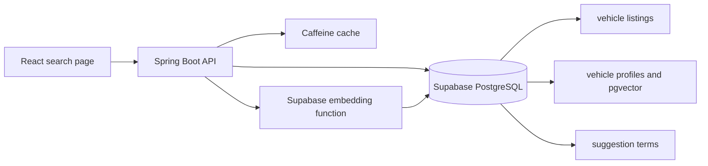

# Vehicle Auction Search MVP Design

## Purpose

Build a small but credible vehicle-auction search application in six hours. Users can type a query, receive debounced suggestions, and view paginated results ranked by relevance. Exact search is preferred; fuzzy and semantic results are used when an exact match is unavailable.

The source is the [Vehicle Sales Data dataset on Kaggle](https://www.kaggle.com/datasets/syedanwarafridi/vehicle-sales-data), containing about 559,000 historical auction records with make, model, trim, body, condition, mileage, price, seller, state, and sale date.

## Architecture

- **React:** search box, 250 ms suggestion debounce, request cancellation, a small browser cache, result cards, and previous/next pagination.
- **Spring Boot:** validates requests, applies search rules, calls database functions, caches responses, and returns a consistent API model.
- **Supabase PostgreSQL:** stores the dataset and performs full-text, trigram, and vector searches. PostgreSQL remains the only persistent service.
- **Supabase embedding function:** creates a 384-dimension embedding for semantic queries and vehicle profiles using `gte-small`.

## Data Model

### vehicle listings

Contains the full auction dataset. Important fields are `id`, `year`, `make`, `model`, `trim`, `body`, `transmission`, `state`, `condition`, `odometer`, `mmr`, `selling_price`, `sale_date`, and `profile_id`.

Two generated search fields are added:

- `search_vector`: weighted full-text data. Make and model have the highest weight, followed by trim and body.
- `normalized_title`: lowercase text such as `2020 bmw m3 competition sedan`, used for trigram similarity.

The table has a GIN full-text index, a trigram index, and normal indexes on `make`, `model`, and `profile_id`.

### vehicle profiles

Stores one row for each distinct normalized make, model, and body combination. It contains `profile_text` and one pgvector embedding. Many auction records can reference the same profile, avoiding an embedding for every listing.

### suggestion terms

Stores unique makes, models, trims, and common combinations with a frequency count. Prefix and trigram indexes support fast suggestions and typo recovery.

## Search and Ranking

The search endpoint uses three ordered stages:

1. **Exact/full-text:** search all listings and rank with `ts_rank_cd`. Exact make, model, and year matches receive boosts.
2. **Fuzzy:** if exact results are insufficient, use `pg_trgm` against model terms and `normalized_title`. A recognized make such as BMW is preserved as a filter or strong boost.
3. **Semantic:** if the earlier stages remain insufficient, compare the query embedding with vehicle-profile embeddings, then join the best profiles back to listings.

Results are ordered by match type (`EXACT`, `FUZZY`, then `SEMANTIC`), score descending, sale date descending, and ID ascending. The API returns `matchType` and `score` so the UI can explain fallback results.

Example: `BMW M3 220e` first looks for a direct match. If none exists, it can return BMW M3, BMW 330e, BMW 230i, and related BMW 3 Series records instead of unrelated makes.

## API and UI

- `GET /api/suggestions?q=` returns at most eight prefix or fuzzy suggestions.
- `GET /api/search?q=&page=&size=` returns 100 results by default, `hasNext`, search mode, and elapsed time.

The UI is one responsive page with a search input, suggestion dropdown, submit button, result count/status, simple result cards, and previous/next controls. Empty, loading, fallback, and error states are shown. Page size is fixed at 100 by default and capped at 100, while pagination is limited to the top 500 ranked results.

## Caching and Invalidation

- React caches suggestions by normalized prefix for the browser session.
- Spring Caffeine caches suggestions for 30 minutes and search pages for 5 minutes with bounded entry counts.
- Cache keys include normalized query, page, size, and `datasetVersion`.
- A successful dataset import increments `datasetVersion` and clears both backend caches. The selected dataset is static, so change-data-capture is unnecessary.

## Performance and Reliability

The target is a warm-cache response below 200 ms and a cold exact/fuzzy response below 1 second, leaving room for semantic fallback to remain below the required 2 seconds. All database searches use indexed expressions and bounded result sets. Obsolete suggestion requests are cancelled. Semantic failure degrades to fuzzy results rather than failing the entire search.

Verification will include `EXPLAIN ANALYZE` for exact, typo, and semantic queries; API timing logs; pagination stability; cache hit/eviction tests; and a small query set covering exact models, misspellings, nonexistent models, and natural-language descriptions.

## Tradeoffs and Scope Cuts

| Decision | Tradeoff and reason |
|---|---|
| PostgreSQL search instead of OpenSearch | Less specialized search tuning, but no second datastore or synchronization work. It is realistic within six hours. |
| Caffeine instead of Redis | Cache is local to one backend instance, but setup and invalidation are simple for an assignment deployment. |
| Embed vehicle profiles instead of 559,000 listings | Semantic ranking is less sensitive to individual mileage or price, but generation, storage, and indexing are much smaller. Listing details remain searchable through full-text search. |
| Conditional fallback instead of always combining all search modes | Ranking is easier to explain and faster. Exact matches are not diluted by semantic results. |
| Limit ranking to the top 500 results | Deep pagination is unavailable, but database work stays bounded and users rarely inspect hundreds of ranked results. |

Authentication, saved searches, advanced filters, analytics, images, live dataset synchronization, personalized ranking, Redis, and a separate search cluster are out of scope. They do not demonstrate the core search requirements and would put the six-hour deadline at risk.

## Six Hour Implementation Plan

1. **0:00–0:30:** create Supabase, Spring Boot, and React projects; enable `pg_trgm` and `vector`.
2. **0:30–1:30:** clean/import CSV data, create profiles and suggestion terms, and build indexes.
3. **1:30–3:00:** implement search database functions, repositories, APIs, validation, and Caffeine caches.
4. **3:00–4:00:** build the React search page, suggestions, result cards, and pagination.
5. **4:00–5:00:** generate profile embeddings and connect semantic fallback.
6. **5:00–6:00:** test representative queries, measure latency, fix ranking issues, and prepare the demo.

## Acceptance Criteria

- Suggestions appear after debounce and recover common misspellings.
- Exact results are ranked ahead of fuzzy and semantic results.
- A nonexistent model returns clearly labeled probable alternatives.
- Results are paginated and stable between requests.
- Typical searches complete within 2 seconds.
- Re-importing data invalidates stale cached results.
